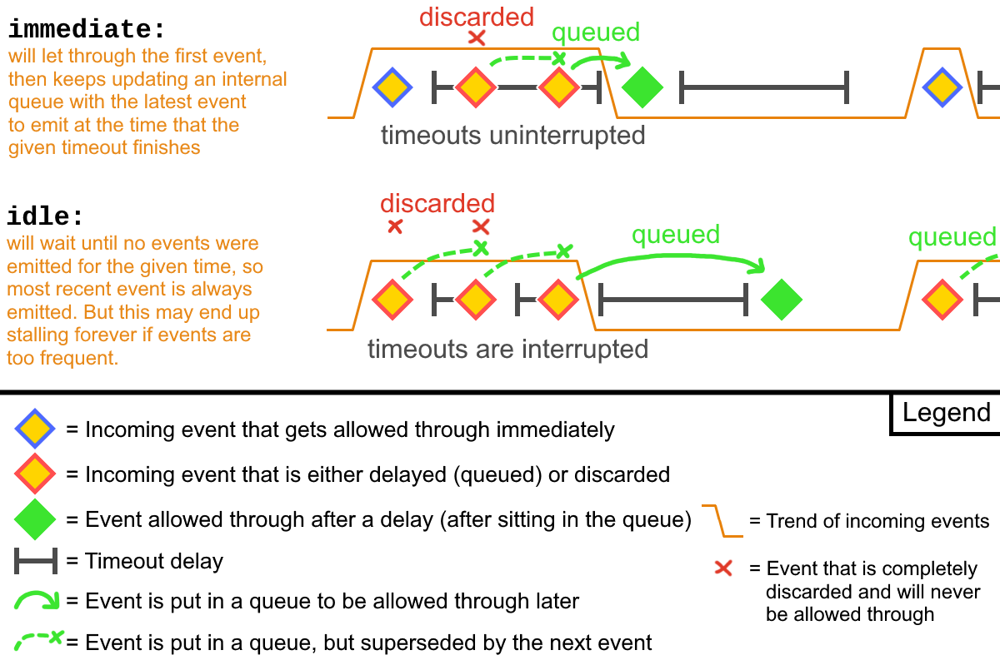

# CoreUtils Documentation
Core library used by [@sv443-network/userutils](https://github.com/Sv443-Network/UserUtils) and [@sv443-network/djsutils](https://github.com/Sv443-Network/DJSUtils)  
  
If you like using this library, please consider [supporting the development ❤️](https://github.com/sponsors/Sv443)

<br>


<!-- #region Preamble -->
## Preamble:
This library is written in TypeScript and contains builtin TypeScript declarations, but it will also work in plain JavaScript after removing the `: type` annotations in the example code snippets.  
  
Each feature's example code snippet can be expanded by clicking on the text "Example - click to view".  
The signatures and examples are written in TypeScript and use ESM import syntax to show you which types need to be provided and will be returned.  
The library itself supports importing an ESM, CommonJS or global variable definition bundle, depending on your use case.  
  
If the signature section contains multiple signatures of the function, each occurrence represents an overload and you can choose which one you want to use.  
They will also be further explained in the description below that section.  
  
Warning emojis (⚠️) denote special cautions or important notes that you should be aware of when using the feature.  
  
If you need help with something, please [create a new discussion](https://github.com/Sv443-Network/CoreUtils/discussions) or [join my Discord server.](https://dc.sv443.net/)  
For submitting bug reports or feature requests, please use the [GitHub issue tracker.](https://github.com/Sv443-Network/CoreUtils/issues)

<br>

<!-- #region Features -->
## Table of Contents:
- [**Preamble** (info about the documentation)](#preamble)
- [**Features**](#features)
  - [**Array:**](#array)
    - 🟣 [`function randomItem()`](#function-randomitem) - Returns a random item from the given array
    - 🟣 [`function randomItemIndex()`](#function-randomitemindex) - Returns a random array item and index as a tuple
    - 🟣 [`function randomizeArray()`](#function-randomizearray) - Returns a new array with the items in random order
    - 🟣 [`function takeRandomItem()`](#function-takerandomitem) - Returns a random array item and mutates the array to remove it
    - 🟣 [`function takeRandomItemIndex()`](#function-randomitemindex) - Returns a random array item and index as a tuple and mutates the array to remove it
    - 🔷 [`type NonEmptyArray`](#type-nonemptyarray) - Non-empty array type
  - [**Colors:**](#colors)
    - 🟣 [`function darkenColor()`](#function-darkencolor) - Darkens the given color by the given percentage
    - 🟣 [`function hexToRgb()`](#function-hextorgb) - Converts a hex color string to an RGB object
    - 🟣 [`function lightenColor()`](#function-lightencolor) - Lightens the given color by the given percentage
    - 🟣 [`function rgbToHex()`](#function-rgbtohex) - Converts an RGB object to a hex color string
  - [**Crypto:**](#crypto)
    - 🟣 [`function abtoa()`](#function-abtoa) - Converts an ArrayBuffer to a string
    - 🟣 [`function atoab()`](#function-atoab) - Converts a string to an ArrayBuffer
    - 🟣 [`function compress()`](#function-compress) - Compresses the given string using the given algorithm (gzip/deflate) and encoding
    - 🟣 [`function decompress()`](#function-decompress) - Decompresses the given string using the given algorithm (gzip/deflate) and encoding
    - 🟣 [`function computeHash()`](#function-computehash) - Computes a string's hash using the given algorithm (SHA-x, MD5, ...)
    - 🟣 [`function randomId()`](#function-randomid) - Generates a random ID of the given length
  - *[**DataStore:**](#datastore) - Cross-platform, general-purpose, sync/async hybrid, JSON-serializable database infrastructure
    - 🟧 *[`class DataStore`](#class-datastore) - The main class for the data store
      - 🔷 *[`type DataStoreOptions`](#type-datastoreoptions) - Options for the data store
    - 🟧 *[`class DataStoreSerializer`](#class-datastoreserializer) - Serializes and deserializes data for multiple DataStore instances
      - 🔷 *[`type DataStoreSerializerOptions`](#type-datastoreserializeroptions) - Options for the DataStoreSerializer
      - 🔷 *[`type LoadStoresDataResult`](#type-loadstoresdataresult) - Result of calling [`loadStoresData()`](#datastoreserializer-loadstoresdata)
      - 🔷 *[`type SerializedDataStore`](#type-serializeddatastore) - Meta object and serialized data of a DataStore instance
      - 🔷 *[`type StoreFilter`](#type-storefilter) - Filter for selecting data stores
    - 🟧 *[`class DataStoreEngine`](#class-datastoreengine) - Base class for DataStore storage engines
      - 🔷 *[`type DataStoreEngineOptions`](#type-datastoreengineoptions) - Options for the data store engine
    - 🟧 *[`class BrowserStorageEngine`](#class-browserstorageengine) - Storage engine for browser environments (localStorage, sessionStorage)
      - 🔷 *[`type BrowserStorageEngineOptions`](#browserstorageengineoptions) - Options for the browser storage engine
    - 🟧 *[`class JSONFileEngine`](#class-jsonfileengine) - Storage engine for Node.js environments (JSON file)
      - 🔷 *[`type JSONFileEngineOptions`](#jsonfileengineoptions) - Options for the JSON file engine
  - [**Debouncer:**](#debouncer)
    - 🟣 [`function debounce()`](#function-debounce) - Function wrapper for the [`Debouncer` class](#class-debouncer)
    - 🟧 [`class Debouncer`](#class-debouncer) - Class that manages listeners whose calls are rate-limited
    - 🔷 [`type DebouncerType`](#type-debouncertype) - The triggering type for the debouncer
    - 🔷 [`type DebouncedFunction`](#type-debouncedfunction) - Function type that is returned by the [`debounce()` function](#debounce)
    - 🔷 [`type DebouncerEventMap`](#type-debouncereventmap) - 
  - *[**Errors:**](#errors)
    - 🟧 *[`class DatedError`](#class-datederror) - Base error class with a `date` property
    - 🟧 *[`class ChecksumMismatchError`](#class-checksummismatcherror) - Error thrown when two checksums don't match
    - 🟧 *[`class MigrationError`](#class-migrationerror) - Error thrown in a failed data migration
  - [**Math:**](#math)
    - 🟣 [`function bitSetHas()`](#function-bitsethas) - Checks if a bit is set in a bitset
    - 🟣 *[`function clamp()`](#function-clamp) - Clamps a number between a given range
    - 🟣 *[`function digitCount()`](#function-digitcount) - Returns the number of digits in a number
    - 🟣 [`function formatNumber()`](#function-formatnumber) - Formats a number to a string using the given locale and format identifier
      - 🔷 [`type NumberFormat`](#type-numberformat) - Number format identifier
    - 🟣 *[`function mapRange()`](#function-maprange) - Maps a number from one range to another
    - 🟣 *[`function randRange()`](#function-randrange) - Returns a random number in the given range
    - 🟣 [`function roundFixed()`](#function-roundfixed) - Rounds the given number to the given number of decimal places
    - 🟣 [`function valsWithin()`](#function-valswithin) - Checks if the given numbers are within a certain range of each other
  - *[**Misc:**](#misc)
    - 🟣 *[`function pauseFor()`](#function-pausefor) - Pauses async execution for the given amount of time
    - 🟣 *[`function fetchAdvanced()`](#function-fetchadvanced) - Wrapper around [`fetch()`](https://developer.mozilla.org/en-US/docs/Web/API/Fetch_API) with options like a timeout
      - 🔷 *[`type FetchAdvancedOpts`](#type-fetchadvancedopts) - Options for the [`fetchAdvanced()`](#function-fetchadvanced) function
    - 🟣 *[`function consumeGen()`](#function-consumegen) - Consumes a [`ValueGen` object](#type-valuegen)
      - 🔷 *[`type ValueGen`](#type-valuegen) - A value that can be either type T, or a sync or async function that returns T
    - 🟣 *[`function consumeStringGen()`](#function-consumestringgen) - Consumes a [`StringGen` object](#type-stringgen)
      - 🔷 *[`type StringGen`](#type-stringgen) - A value that can be either of type string, or a sync or async function that returns a string
    - 🟣 *[`function getListLength()`](#function-getlistlength) - Returns the length of a [`ListLike` object](#type-listlike)
      - 🔷 *[`type ListLike`](#type-listlike) - Any value with a quantifiable `length`, `count` or `size` property
    - 🟣 *[`function pureObj()`](#function-pureobj) - Applies an object's props to a null object (object without prototype chain) or just returns a new null object
  - *[**NanoEmitter:**](#nanoemitter)
    - 🟧 *[`class NanoEmitter`](#class-nanoemitter) - Simple, lightweight event emitter class based on [`node:events`' `EventEmitter`](https://nodejs.org/api/events.html#class-eventemitter) and [`nanoevents`](https://npmjs.com/package/nanoevents) that can be used in both FP and OOP
      - 🔷 *[`type NanoEmitterOptions`](#type-nanoemitteroptions) - Options for the [`NanoEmitter` class](#class-nanoemitter)
  - [**Text:**](#text)
    - 🟣 [`function autoPlural()`](#function-autoplural) - Turns the given term into its plural form, depending on the given number or list length
    - 🟣 [`function capitalize()`](#function-capitalize) - Capitalizes the first letter of the given string
    - 🟣 [`function createProgressBar()`](#function-createprogressbar) - Creates a progress bar string with the given percentage and length
      - 🟩 [`const defaultPbChars`](#const-defaultpbchars) - Default characters for the progress bar
      - 🔷 [`type ProgressBarChars`](#type-progressbarchars) - Type for the progress bar characters object
    - 🟣 [`function joinArrayReadable()`](#function-joinarrayreadable) - Joins the given array into a string, using the given separators and last separator
    - 🟣 [`function secsToTimeStr()`](#function-sectostimestr) - Turns the given number of seconds into a string in the format `(hh:)mm:ss` with intelligent zero-padding
    - 🟣 [`function truncStr()`](#function-truncstr) - Truncates the given string to the given length
  - *[**Translate:**](#translate)
    - 🟧 *[`class Translate`](#class-translate) - JSON-based translation system supporting transformation hooks, value injection, nested objects, etc.
    - 🔷 *[`type TransformFn`](#type-transformfn) - The type of the transformation hook functions
    - 🔷 *[`type TransformFnProps`](#type-transformfnprops) - The properties passed to the transformation functions
    - 🔷 *[`type TranslateOptions`](#type-translateoptions) - The options for the [`Translate` class](#class-translate)
    - 🔷 *[`type TrKeys`](#type-trkeys) - Generic type that gives you a union of keys from the passed [`TrObject` object](#type-trobject)
    - 🔷 *[`type TrObject`](#type-trobject) - The translation object for a specific language
  - [**Misc. Types:**](#types)
    TODO:

<br><br><br>

<!-- #region Features -->
## Features:

<br>

<!-- #region array -->
## Array

### `function randomItem()`
Signature:
```ts
randomItem<TItem = unknown>(array: TItem[]): TItem | undefined;
```
  
Returns a random item from the given array.  
If the array is empty, `undefined` will be returned.  
  
<details><summary>Example - click to view</summary>

```ts
import { randomItem } from "@sv443-network/coreutils";

const arr = ["foo", "bar", "baz"];

console.log(randomItem(arr)); // "bar"
console.log(randomItem(arr)); // "bar"
console.log(randomItem(arr)); // "foo"
console.log(randomItem([]));  // undefined
```
</details>

<br>

### `function randomItemIndex()`
Signature:
```ts
randomItemIndex<TItem = unknown>(array: TItem[]): [item?: TItem, index?: number];
```
  
Returns a random item and its index as a tuple from the given array.  
If the array is empty, `undefined` will be returned for both values.  
  
<details><summary>Example - click to view</summary>

```ts
import { randomItemIndex } from "@sv443-network/coreutils";

const arr = ["foo", "bar", "baz"];

console.log(randomItemIndex(arr)); // ["bar", 1]

// if only the index is needed:
const [, myIndex] = randomItemIndex(arr);
console.log(myIndex); // 2
```
</details>

<br>

### `function randomizeArray()`
Signature:
```ts
randomizeArray<TItem = unknown>(array: TItem[]): TItem[]
```
  
Returns a new array with the items in random order.  
Doesn't mutate the original array.  
  
<details><summary>Example - click to view</summary>

```ts
import { randomizeArray } from "@sv443-network/coreutils";

const arr = ["foo", "bar", "baz"];

const randomized = randomizeArray(arr);
console.log(randomized); // ["baz", "foo", "bar"]
```
</details>

<br>

### `function takeRandomItem()`
Signature:
```ts
takeRandomItem<TItem = unknown>(arr: TItem[]): TItem | undefined;
```
  
Returns a random item from the given array and mutates the original array to remove it.  
If the array is empty, `undefined` will be returned.  
  
<details><summary>Example - click to view</summary>

```ts
import { takeRandomItem } from "@sv443-network/coreutils";

const arr = ["foo", "bar", "baz"];

console.log(takeRandomItem(arr)); // "bar"
console.log(arr); // ["foo", "baz"]

console.log(takeRandomItem(arr)); // "baz"
console.log(arr); // ["foo"]

console.log(takeRandomItem(arr)); // "foo"
console.log(arr); // []

console.log(takeRandomItem(arr)); // undefined
console.log(arr); // []
```
</details>

<br>

### `function takeRandomItemIndex()`
Signature:
```ts
takeRandomItemIndex<TItem = unknown>(arr: TItem[]): [item?: TItem, index?: number];
```
  
Returns a random item and its index as a tuple from the given array and mutates the original array to remove it.  
If the array is empty, `undefined` will be returned for both values.  
  
<details><summary>Example - click to view</summary>

```ts
import { takeRandomItemIndex } from "@sv443-network/coreutils";

const arr = ["foo", "bar", "baz"];

console.log(takeRandomItemIndex(arr)); // ["bar", 1]
console.log(arr); // ["foo", "baz"]

console.log(takeRandomItemIndex(arr)); // ["baz", 1]
console.log(arr); // ["foo"]

console.log(takeRandomItemIndex(arr)); // ["foo", 0]
console.log(arr); // []

console.log(takeRandomItemIndex(arr)); // [undefined, undefined]
console.log(arr); // []
```
</details>

<br>

### `type NonEmptyArray`
```ts
type NonEmptyArray<TArray = unknown> = [TArray, ...TArray[]];
```
  
Describes an array with at least one item.  
  
<details><summary>Example - click to view</summary>

```ts
import type { NonEmptyArray } from "@sv443-network/coreutils";

function foo(arr: NonEmptyArray<string>) {
  console.log(arr.join(", "));
}

foo(["foo", "bar"]); // "foo, bar"
// @ts-expect-error
foo([]);             // TypeError
```
</details>

<br><br>

<!-- #region colors -->
## Colors

<br>

### `function darkenColor()`
Signature:
```ts
function darkenColor(color: string, percent: number, upperCase = false): string;
```
  
Darkens the given CSS color value (in `#HEX`, `HEX`, `rgb()` or `rgba()` format) by the given decimal percentage.  
A negative percentage will lighten the color, just like the [`lightenColor()` function.](#function-lightencolor)  
The color values will not exceed their maximum range (`00-FF` / `0-255`) and the alpha value will be preserved.  
Returns the new color in the same format as the input.  
Throws if the color format is invalid or not supported.  
  
<details><summary>Example - click to view</summary>

```ts
import { darkenColor } from "@sv443-network/coreutils";

darkenColor("#1affe3", 20);                   // #15ccb6
darkenColor("#1affe3", 20, true);             // #15CCB6
darkenColor("1affe369", 20);                  // 15ccb669
darkenColor("rgb(26, 255, 227)", 20);       // rgb(20.8, 204, 181.6)
darkenColor("rgba(26, 255, 227, 0.2)", 20); // rgba(20.8, 204, 181.6, 0.2)
darkenColor("rgba()", 20); // TypeError: Invalid RGB/RGBA color format
darkenColor("#1affe3");    // #nannannan
```
</details>

<br>

### `function hexToRgb()`
Signature:
```ts
function hexToRgb(hex: string): [red: number, green: number, blue: number, alpha?: number];
```
  
Converts the given hex color string in the format `#RRGGBB`, `#RRGGBBAA`, `#RGB` or `#RGBA` (even without the `#` hash symbol) to an RGB(A) tuple.  
R, G and B will be an integer in the range `0-255` and alpha is a float in the range `0-1`, or `undefined` if no alpha channel exists.  
  
<details><summary>Example - click to view</summary>

```ts
import { hexToRgb } from "@sv443-network/coreutils";

console.log(hexToRgb("#1affe3"));   // [ 26, 255, 227, undefined ]
console.log(hexToRgb("1234"));      // [ 17, 34, 51, 0.26666666666666666 ]
console.log(hexToRgb("#1affe369")); // [ 26, 255, 227, 0.4117647058823529 ]
console.log(hexToRgb(""));          // [ 0, 0, 0, undefined ]
```
</details>

<br>

### `function lightenColor()`
Signature:
```ts
function lightenColor(color: string, percent: number, upperCase = false): string;
```
  
Lightens the given CSS color value (in `#HEX`, `HEX`, `rgb()` or `rgba()` format) by the given decimal percentage.  
A negative percentage will darken the color.  
Works by calling the [`darkenColor()` function](#function-darkencolor) after multiplying the percentage by `-1`.  
  
See the [`darkenColor()` function](#function-darkencolor) for an example.  

<br>

### `function rgbToHex()`
Signature:
```ts
function rgbToHex(red: number, green: number, blue: number, alpha?: number, withHash = true, upperCase = false): string;
```
  
Converts the given RGB(A) values to a hex color string in the format `#RRGGBB` or `#RRGGBBAA`.  
The `red`, `green` and `blue` arguments must be integers in the range `0-255`, the `alpha` argument can be a float in the range `0-1`.  
The `withHash` argument determines if the returned string should start with a `#` hash symbol.  
The `upperCase` argument determines if the hex string should be in upper case.  
  
<details><summary>Example - click to view</summary>

```ts
import { rgbToHex } from "@sv443-network/coreutils";

console.log(rgbToHex(18, 52, 86, 0.47058823529411764)); // #12345678
console.log(rgbToHex(18, 52, 86));                      // #123456
console.log(rgbToHex());                                // #nannannan
```
</details>

<br><br>

<!-- #region crypto -->
## Crypto

<br>

### `function abtoa()`
Signature:
```ts
function abtoa(buf: ArrayBuffer): string;
```
  
Converts an ArrayBuffer to a base64-encoded (ASCII) string.  
Used to encode a value to be later decoded with the [`atoab()` function](#function-atoab).  
  
<details><summary>Example - click to view</summary>

```ts
import { abtoa } from "@sv443-network/coreutils";

const buffer = new ArrayBuffer(8);
const view = new Uint8Array(buffer);
view.set([1, 2, 3, 4, 5, 6, 7, 8]);
const base64 = abtoa(buffer);
console.log(base64); // AQIDBAUGBwg=
```
</details>

<br>

### `function atoab()`
Signature:
```ts
function atoab(str: string): ArrayBuffer;
```
  
Converts a base64-encoded (ASCII) string to an ArrayBuffer.  
Used to decode a value previously encoded with the [`abtoa()` function](#function-abtoa).  
  
<details><summary>Example - click to view</summary>

```ts
import { atoab } from "@sv443-network/coreutils";

const base64 = "AQIDBAUGBwg="; // see abtoa() example
const buffer = atoab(base64);
const view = new Uint8Array(buffer);
console.log(view); // Uint8Array(8) [ 1, 2, 3, 4, 5, 6, 7, 8 ]
```
</details>

<br>

### `function compress()`
Signature:
```ts
function compress(input: Stringifiable | ArrayBuffer, compressionFormat: CompressionFormat, outputType: "string" | "arrayBuffer" = "string"): Promise<ArrayBuffer | string>;
```
  
Compresses the given string or ArrayBuffer using the given algorithm and encoding.  
The `input` argument can be a [`Stringifiable`](#type-stringifiable) object or an ArrayBuffer.  
The `compressionFormat` argument can usually be either `gzip`, `deflate` or `deflate-raw`.  
The `outputType` argument determines if the returned value should be a base64-encoded string or an ArrayBuffer.  
  
<details><summary>Example - click to view</summary>

```ts
import { compress, decompress } from "@sv443-network/coreutils";

const str = "Hello, world!".repeat(1000);
const compressed = await compress(str, "gzip");
console.log(compressed); // "H4sIAAAAAAAACu3HoQ0AIAwAsFfAc8gOAbdkyQzvcwWudY2TWWvc6twzRERERERERERERERERERERERERERERERERP7kAddDUSnIMgAA"

const decompressed = await decompress(compressed, "gzip");
console.log(str === decompressed); // true
```
</details>

<br>

### `function decompress()`
Signature:
```ts
function decompress(input: Stringifiable | ArrayBuffer, compressionFormat: CompressionFormat, outputType: "string" | "arrayBuffer" = "string"): Promise<ArrayBuffer | string>;
```
  
Decompresses the previously compressed string or ArrayBuffer using the given algorithm and encoding.  
The `input` argument can be a [`Stringifiable`](#type-stringifiable) object or an ArrayBuffer.  
The `compressionFormat` argument can usually be either `gzip`, `deflate` or `deflate-raw`.  
The `outputType` argument determines if the returned value should be a base64-encoded string or an ArrayBuffer.  
  
<details><summary>Example - click to view</summary>

```ts
import { compress, decompress } from "@sv443-network/coreutils";

const str = "Hello, world!".repeat(1000);
const compressed = await compress(str, "gzip");
console.log(compressed); // "H4sIAAAAAAAACu3HoQ0AIAwAsFfAc8gOAbdkyQzvcwWudY2TWWvc6twzRERERERERERERERERERERERERERERERERP7kAddDUSnIMgAA"

const decompressed = await decompress(compressed, "gzip");
console.log(str === decompressed); // true
```
</details>

<br>

### `function computeHash()`
Signature:
```ts
function computeHash(input: string | ArrayBuffer, algorithm = "SHA-256"): Promise<string>;
```
<!-- Creates a hash / checksum of the given {@linkcode input} string or ArrayBuffer using the specified {@linkcode algorithm} ("SHA-256" by default).  
 *   
 * - ⚠️ Uses the SubtleCrypto API so it needs to run in a secure context (HTTPS).  
 * - ⚠️ If you use this for cryptography, make sure to use a secure algorithm (under no circumstances use SHA-1) and to [salt](https://en.wikipedia.org/wiki/Salt_(cryptography)) your input data. -->
  
Creates a hash / checksum of the given string or ArrayBuffer using the specified algorithm ("SHA-256" by default).  
  
- ⚠️ Uses the SubtleCrypto API so in a DOM environment this needs to run in a secure context (HTTPS).
- ⚠️ If you use this for cryptography, make sure to use a secure algorithm (under no circumstances use SHA-1) and to [salt your input.](https://en.wikipedia.org/wiki/Salt_(cryptography))

<details><summary>Example - click to view</summary>

```ts
const sha256 = await computeHash("Hello, world!");
const sha512 = await computeHash("Hello, world!", "SHA-512");

console.log(sha256); // "315f5bdb76d078c43b8ac0064e4a0164612b1fce77c869345bfc94c75894edd3"
console.log(sha512); // "c1527cd893c124773d811911970c8fe6e857d6df5dc9226bd8a160614c0cd963a4ddea2b94bb7d36021ef9d865d5cea294a82dd49a0bb269f51f6e7a57f79421"
```
</details>

<br>

### `function randomId()`
Signature:
```ts
function randomId(length = 16, radix = 16, enhancedEntropy = false, randomCase = true): string;
```
  
Generates a random ID of a given length and [radix (base).](https://en.wikipedia.org/wiki/Radix)  
  
The default length is 16 and the default radix is 16 (hexadecimal).  
You may change the radix to get digits from different numerical systems.  
Use 2 for binary, 8 for octal, 10 for decimal, 16 for hexadecimal and 36 for alphanumeric.  
  
If `enhancedEntropy` is set to true (false by default), the [Web Crypto API](https://developer.mozilla.org/en-US/docs/Web/API/Crypto/getRandomValues) is used for generating the random numbers.  
Note that this makes the function call take longer, but the generated IDs will have a higher entropy.  
  
If `randomCase` is set to true (which it is by default), the generated ID will contain both upper and lower case letters.  
This randomization is also affected by the `enhancedEntropy` setting, unless there are no alphabetic characters in the output in which case it will be skipped.  
  
Throws a RangeError if the length is less than 1 or the radix is less than 2 or greater than 36.  
  
⚠️ This is not suitable for generating anything related to cryptography! Use [SubtleCrypto's `generateKey()`](https://developer.mozilla.org/en-US/docs/Web/API/SubtleCrypto/generateKey) for that instead.  
  
<details><summary>Example - click to view</summary>

```ts
import { randomId } from "@sv443-network/coreutils";

randomId();                    // "1bda419a73629d4f" (length 16, radix 16)
randomId(10);                  // "f86cd354a4"       (length 10, radix 16)
randomId(10, 2);               // "1010001101"       (length 10, radix 2)
randomId(10, 10);              // "0183428506"       (length 10, radix 10)
randomId(10, 36, false, true); // "z46jFPa37R"       (length 10, radix 36, random case)


// performance benchmark:

function benchmark(enhancedEntropy: boolean, randomCase: boolean) {
  const timestamp = Date.now();
  for(let i = 0; i < 10_000; i++)
    randomId(16, 36, enhancedEntropy, randomCase);
  console.log(`Generated 10k in ${Date.now() - timestamp}ms`)
}

// using Math.random():
benchmark(false, false); // Generated 10k in 239ms
benchmark(false, true);  // Generated 10k in 248ms

// using crypto.getRandomValues():
benchmark(true, false);  // Generated 10k in 1076ms
benchmark(true, true);   // Generated 10k in 1054ms

// 3rd and 4th have a similar time, but in reality the 4th blocks the event loop for much longer
```
</details>

<br><br>

<!-- #region DataStore -->
## DataStore

<br>

<!-- TODO: -->

<br><br>

<!-- #region Debouncer -->
## Debouncer

<br>

### `class Debouncer`
Signature:
```ts
class Debouncer<TFunc extends (...args: any) => any>
  extends NanoEmitter<DebouncerEventMap<TFunc>>;
```
  
Usage:
```ts
const debouncer = new Debouncer(timeout = 200, type: DebouncerType = "immediate");
```
  
Creates a new Debouncer instance.  
This class manages listeners whose calls are debounced, meaning their frequency is limited to a certain time interval.  
For example you might use this in event listeners that fire frequently (like scroll, resize or mousemove events) to avoid performance issues.  
  
If creating a whole class is too much overhead for your use case, you can also use the standalone [`debounce()` function.](#function-debounce)  
It works similarly to other debounce implementations like `_.debounce()` from Lodash.  
  
If `timeout` is not provided, it will default to 200 milliseconds.  
If `type` isn't provided, it will default to `"immediate"`.  
  
The `type` parameter can be set to `"immediate"` (default and recommended) to let the first call through immediately and then queue the following calls until the timeout is over.  
  
If set to `"idle"`, the debouncer will wait until there is a pause of the given timeout length before executing the queued call.  
Note that this might make the calls be queued up for all eternity if there isn't a long enough gap between them.  

See the below diagram for a visual representation of the different types.  
  
<details><summary><b>Diagram - click to view</b></summary>



</details>

<details><summary>Example - click to view</summary>

```ts
import { Debouncer } from "@sv443-network/coreutils";

const deb = new Debouncer(); // defaults to 200ms and "immediate"

// register a function to be called when the debouncer triggers
deb.addListener(onResize);

window.addEventListener("resize", (evt) => {
  // arguments will be passed along to all registered listeners
  deb.call(evt);
});

function onResize(evt: Event) {
  console.log("Resized to:", window.innerWidth, "x", window.innerHeight);

  // timeout and type can be modified after the fact:
  deb.setTimeout(500);
  deb.setType("idle");
}

// call these from anywhere else to detach the registered listeners:

function removeResizeListener() {
  deb.removeListener(onResize);
}

function removeAllListeners() {
  deb.removeAllListeners();
}

// or using NanoEmitter's event system:

deb.on("call", (...args) => {
  console.log("Debounced call executed with:", args);
});

deb.on("change", (timeout, type) => {
  console.log("Timeout changed to:", timeout);
  console.log("Edge type changed to:", type);
});
```
</details>

<br>

### Events:
The Debouncer class inherits from [`NanoEmitter`](#nanoemitter), so you can use all of its inherited methods to listen to the following events:
| Event | Arguments | Description |
| :-- | :-- | :-- |
| `call` | `...TArgs[]`, same as `addListener()` and `call()` | Emitted when the debouncer triggers and calls all listener functions, as an event-driven alternative to the callback-based `addListener()` method. |
| `change` | `timeout: number`, `type: "immediate" \| "idle"` | Emitted when the timeout or type settings were changed. |

<br>

### Methods:

<br>

#### `Debouncer.addListener()`
Signature:
```ts
addListener(fn: ((...args: TArgs[]) => void | unknown)): void;
```
  
Adds a listener function that will be called on timeout.  
You can attach as many listeners as you want and they will all be called synchronously in the order they were added.

<br>

#### `Debouncer.removeListener()`
Signature:
```ts
removeListener(fn: ((...args: TArgs[]) => void | unknown)): void;
```
  
Removes the listener with the specified function reference.

<br>

#### `Debouncer.removeAllListeners()`
Signature:
```ts
removeAllListeners(): void;
```
  
Removes all listeners.

<br>

#### `Debouncer.call()`
Signature:
```ts
call(...args: TArgs[]): void;
```
  
Use this to call the debouncer with the specified arguments that will be passed to all listener functions registered with `addListener()`.  
Not every call will trigger the listeners - only when there is no active timeout.  
If the timeout is active, the call will be queued until it either gets overridden by the next call or the timeout is over.

<br>

#### `Debouncer.getListeners()`
Signature:
```ts
getListeners(): ((...args: TArgs[]) => void | unknown)[];
```
  
Returns an array of all registered listener functions.

<br>

#### `Debouncer.setTimeout()`
Signature:
```ts
setTimeout(timeout: number): void;
```
  
Changes the timeout for the debouncer.

<br>

#### `Debouncer.getTimeout()`
Signature:
```ts
getTimeout(): number;
```
  
Returns the current timeout.

<br>

#### `Debouncer.isTimeoutActive()`
Signature:
```ts
isTimeoutActive(): boolean;
```
  
Returns `true` if the timeout is currently active, meaning any call to the `call()` method will be queued.

<br>

#### `Debouncer.setType()`
Signature:
```ts
setType(type: "immediate" | "idle"): void;
```
  
Changes the edge type for the debouncer.

<br>

#### `Debouncer.getType()`
Signature:
```ts
getType(): "immediate" | "idle";
```
  
Returns the current edge type.

<br><br>

### `function debounce()`
Signature:
```ts
debounce<
  TFunc extends ((...args: TArgs[]) => void | unknown),
  TArgs = any,
> (
  fn: TFunc,
  timeout?: number,
  type?: "immediate" | "idle",
): TFunc & { debouncer: Debouncer }
```
  
A standalone function that debounces a given function to prevent it from being executed too often.  
The function will wait for the specified timeout between calls before executing the function.  
This is especially useful when dealing with events that fire rapidly, like "scroll", "resize", "mousemove", etc.  
  
This function works in the same way as the [`Debouncer` class](#class-debouncer), but is a more convenient wrapper for less complex use cases.  
Still, you will have access to the created Debouncer instance via the `debouncer` prop on the returned function should you need it.  
  
If `timeout` is not provided, it will default to 200 milliseconds.  
If `type` isn't provided, it will default to `"immediate"`.  
  
The `type` parameter can be set to `"immediate"` (default and recommended) to let the first call through immediately and then queue the following calls until the timeout is over.  
  
If set to `"idle"`, the debouncer will wait until there is a pause of the given timeout length before executing the queued call.  
Note that this might make the calls be queued up for all eternity if there isn't a long enough gap between them.  

See the below diagram for a visual representation of the different types.  
  
<details><summary><b>Diagram - click to view</b></summary>


</details>

<details><summary><b>Example - click to view</b></summary>

```ts
import { debounce } from "@sv443-network/userutils";

// simple example:
window.addEventListener("resize", debounce((evt) => {
  console.log("Resized to:", window.innerWidth, "x", window.innerHeight);
}));

// or if you need access to the Debouncer instance:

function myFunc(iteration: number) {
  // for the edge type "immediate", iteration 0 and 19 will *always* be called
  // this is so you can react immediately and always have the latest data at the end
  console.log(`Call #${iteration} went through!`);
}

// debouncedFunction can be called at very short intervals but will never let calls through twice within 0.5s:
const debouncedFunction = debounce(myFunc, 500);

function increaseTimeout() {
  // instance can be accessed on the function returned by debounce()
  debouncedFunction.debouncer.setTimeout(debouncedFunction.debouncer.getTimeout() + 100);
}

// and now call the function a bunch of times with varying intervals:

let i = 0;
function callFunc() {
  debouncedFunction(i, Date.now());

  i++;
  // call the function 20 times with a random interval between 0 and 1s (weighted towards the lower end):
  if(i < 20)
    setTimeout(callFunc, Math.floor(1000 * Math.pow(Math.random(), 2.5)));
}

// same as with Debouncer, you can use NanoEmitter's event system:

debouncedFunction.debouncer.on("call", (...args) => {
  console.log("Debounced call executed with:", args);
});

debouncedFunction.debouncer.on("change", (timeout, type) => {
  console.log("Timeout changed to:", timeout);
  console.log("Edge type changed to:", type);
});
```

</details>

<br>

### `type DebouncerType`
```ts
type DebouncerType = "immediate" | "idle";
```
The type of edge to use for the debouncer.  
See the diagram below the table for a visual representation of the different types.  

| Type | Description | Pros | Cons |
| :-- | :-- | :-- | :-- |
| `immediate` | Calls the listeners at the very first call ("rising" edge) and queues the latest call until the timeout expires | First call is let through immediately | After all calls stop, the JS engine's event loop will continue to run until the last timeout expires (doesn't really matter on the web, but could cause a process exit delay in Node.js) |
| `idle` | Queues all calls until there are no more calls in the given timeout duration ("falling" edge), and only then executes the very last call | Makes sure there are zero calls in the given `timeoutDuration` before executing the last call | - Calls are always delayed by at least `1 * timeoutDuration`<br>- Calls could get stuck in the queue indefinitely if there is no downtime between calls that is greater than the `timeoutDuration` |

<details><summary><b>Diagram - click to view</b></summary>


</details>

<br>

### `type DebouncedFunction`
```ts
type DebouncedFunction<TFunc extends (...args: any) => any> =
  & ((...args: Parameters<TFunc>) => ReturnType<TFunc>)
  & { debouncer: Debouncer<TFunc> };
```
  
The debounced function type that is returned by the [`debounce()` function.](#function-debounce)  
This type is a function that resembles the function to debounce, but it has an additional property `debouncer` that contains the Debouncer instance.  

<br>

### `type DebouncerEventMap`
```ts
type DebouncerEventMap<TFunc extends (...args: any) => any> = {
  /** Emitted when the debouncer calls all registered listeners, as a pub-sub alternative */
  call: TFunc;
  /** Emitted when the timeout or edge type is changed after the instance was created */
  change: (timeout: number, type: DebouncerType) => void;
};
```
  
This is the event map for the [`Debouncer` class.](#class-debouncer)

<br><br>

<!-- #region math -->
## Math

<br>

### `function bitSetHas()`
Signature:
```ts
bitSetHas<TType extends number | bigint>(bitSet: TType, checkVal: TType): boolean;
```
  
Checks if a bit is set in a bitset.  
The `bitSet` and `checkVal` arguments can be either a `number` or a `bigint`, but both must be of the same type.  
  
<details><summary>Example - click to view</summary>

```ts
import { bitSetHas } from "@sv443-network/coreutils";

const myBitSet = 0b101010;

const checkFoo = 0b000010;
const checkBar = 0b000001;

const checkBig = 2n;

console.log(bitSetHas(myBitSet, checkFoo)); // true
console.log(bitSetHas(myBitSet, checkBar)); // false

console.log(bitSetHas(BigInt(myBitSet), checkBig)); // true
```
</details>

<br>

### `function formatNumber()`
Signature:
```ts
formatNumber(number: number, locale: DiscordLocale, format: NumberFormat): string;
```
  
Formats a number to a string using the given [`DiscordLocale`](#type-discordlocale) and [`NumberFormat`](#type-numberformat).  
  
<details><summary>Example - click to view</summary>

```ts
import { formatNumber } from "@sv443-network/coreutils";

const num = 1234567.89;

console.log(formatNumber(num, "en-US", "long"));  // 1,234,567.89
console.log(formatNumber(num, "de-DE", "long"));  // 1.234.567,89
console.log(formatNumber(num, "hi", "long"));     // 12,34,567.89

console.log(formatNumber(num, "en-US", "short")); // 1.23M
```
</details>

<br>

### `type NumberFormat`
```ts
type NumberFormat = "long" | "short";
```
  
The format identifier for the [`formatNumber()`](#function-formatnumber) function.  
- `long` - Formats the number using the locale's default formatting rules (e.g. `1,234,567.89` in `en-US`).
- `short` - Formats the number using a short format (e.g. `1.23M` in `en-US`).

<br>

### `function roundFixed()`
Signature:
```ts
roundFixed(num: number, dec: number): number;
```
  
Rounds the given number to the given number of decimal places (doesn't just cut off digits but actually uses `Math.round()`).  
The `dec` argument must be an integer and can even be negative to round to the left of the decimal point.  
  
<details><summary>Example - click to view</summary>

```ts
import { roundFixed } from "@sv443-network/coreutils";

const num = 123.456789;

console.log(roundFixed(num, 2)); // 123.46
console.log(roundFixed(num, 1)); // 123.5
console.log(roundFixed(num, 0)); // 123
console.log(roundFixed(num, -1)); // 120
console.log(roundFixed(num, -2)); // 100
```
</details>

<br>

### `function valsWithin()`
Signature:
```ts
valsWithin(a: number, b: number, dec = 10, withinRange = 0.5): boolean;
```
  
Rounds the given values at the given decimal place, then checks if they are both within the given range (0.5 by default).  
The `a` and `b` arguments must be the two numbers to compare.  
The `dec` parameter is the same as in [`roundFixed()`](#function-roundfixed).  
`withinRange` is the range to add and subtract from the rounded value of `a` to check if `b` is within that range.  
  
<details><summary>Example - click to view</summary>

```ts
import { valsWithin } from "@sv443-network/coreutils";

console.log(valsWithin(3, Math.PI, undefined, 0.15)); // true
console.log(valsWithin(3, Math.PI, 0.1));             // false
```
</details>

<br><br>


<!-- #region text -->
## Text

<br>

### `function autoPlural()`
Signature:
```ts
autoPlural(term: Stringifiable, num: number | ListLike, pluralType: "auto" | "-s" | "-ies" = "auto"): string;
```
  
Turns the given [`Stringifiable`](#type-stringifiable) term that's in singular form into its plural form, depending on the given number.  
The `num` argument can be a number or a quantifiable [`ListLike` value](#type-listlike).  
By default, the plural form will be determined automatically, but you can also manually force it to be `-s` or `-ies`.  
  
<details><summary>Example - click to view</summary>

```ts
import { Collection } from "discord.js";
import { autoPlural } from "@sv443-network/coreutils";

autoPlural("red apple", 0); // "red apples"
autoPlural("red apple", 1); // "red apple"
autoPlural("red apple", 2); // "red apples"

// The default `pluralType` ("auto") switches suffix when the word ends with y:
autoPlural("category", 1); // "category"
autoPlural("category", 2); // "categories"

// Stringifiable objects are also accepted:
autoPlural({ toString: () => "category" }, 2); // "categories"
autoPlural(new Map<unknown, unknown>(), 2);    // "[object Map]s"

// The passed `num` object just needs to have a numeric length, count or size property:
const collection = new Collection<string, string>();
collection.set("foo", "bar");
console.log(collection.size, autoPlural("item", collection)); // "1 item"

const items = [1, 2, 3, 4, "foo", "bar"];
console.log(items.length, autoPlural("item", items)); // "6 items"

// And you can also force pluralization with one or the other if needed:
autoPlural("category", 1, "-s"); // "category"
autoPlural("category", 2, "-s"); // "categorys"
autoPlural("apple", 1, "-ies");  // "apply"
autoPlural("apple", 2, "-ies");  // "applies"
```
</details>

<br>

### `function capitalize()`
Signature:
```ts
capitalize(text: string): string;
```
  
Capitalizes the first letter of the given string.  
  
<details><summary>Example - click to view</summary>

```ts
import { capitalize } from "@sv443-network/coreutils";

console.log(capitalize("hello, world!")); // "Hello, world!"
```
</details>

<br>

### `function createProgressBar()`
Signature:
```ts
createProgressBar(percentage: number, barLength: number, chars: ProgressBarChars = defaultPbChars): string;
```
  
Creats a progress bar string with the given percentage and length.  
The `percentage` argument must be a number between 0 and 100.  
Use `chars` to modify the characters used in the progress bar. By default, [`defaultPbChars`](#const-defaultpbchars) will be used.  
  
<details><summary>Example - click to view</summary>

```ts
import { createProgressBar, defaultPbChars } from "@sv443-network/coreutils";

console.log(createProgressBar(0, 10));   // ──────────
console.log(createProgressBar(25, 10));  // ██▓───────
console.log(createProgressBar(30, 10));  // ███▓──────
console.log(createProgressBar(99, 10));  // █████████▓
console.log(createProgressBar(100, 10)); // ██████████

// overwrite the 0% character:
const customChars = {
  ...defaultPbChars,
  0: "•",
};
console.log(createProgressBar(50, 4, customChars)); // ██••
```
</details>

<br>

#### `const defaultPbChars`
This object contains the default characters for the progress bar.  
It is of type [`ProgressBarChars`](#type-progressbarchars) and contains the following properties:
| Property | Value |
| :-- | :-- |
| `defaultPbChars[100]` | █ |
| `defaultPbChars[75]` | ▓ |
| `defaultPbChars[50]` | ▒ |
| `defaultPbChars[25]` | ░ |
| `defaultPbChars[0]` | ─ |

<br>

#### `type ProgressBarChars`
Signature:
```ts
type ProgressBarChars = Record<100 | 75 | 50 | 25 | 0, string>;
```
  
This type defines the characters used in the function [`createProgressBar()`](#function-createprogressbar).  
Each property is a number that represents the percentage of each segment of the progress bar.  
So a progress bar with a length of 2 and value of 25% would be represented by the characters `50` and `0`.  

<br>

### `function joinArrayReadable()`
Signature:
```ts
joinArrayReadable(array: unknown[], separators = ", ", lastSeparator = " and "): string;
```
  
Joins the given array into a string, using the given separators.  
Allows for choosing a different separator for the last element.  
  
<details><summary>Example - click to view</summary>

```ts
import { joinArrayReadable } from "@sv443-network/coreutils";

const arr = ["foo", "bar", "baz"];
console.log(joinArrayReadable(arr)); // foo, bar, and baz
```
</details>

<br>

### `function secsToTimeStr()`
Signature:
```ts
secsToTimeStr(seconds: number): string;
```
  
Turns the given number of seconds into a string in the format `(hh:)mm:ss` with intelligent zero-padding.  
  
<details><summary>Example - click to view</summary>

```ts
import { secsToTimeStr } from "@sv443-network/coreutils";

console.log(secsToTimeStr(0));    // 0:0
console.log(secsToTimeStr(1));    // 0:01
console.log(secsToTimeStr(10));   // 0:10
console.log(secsToTimeStr(59));   // 0:59
console.log(secsToTimeStr(60));   // 01:00
console.log(secsToTimeStr(61));   // 01:01
console.log(secsToTimeStr(599));  // 09:59
console.log(secsToTimeStr(600));  // 10:00
console.log(secsToTimeStr(601));  // 10:01
console.log(secsToTimeStr(3599)); // 59:59
console.log(secsToTimeStr(3600)); // 1:00:00
console.log(secsToTimeStr(3601)); // 1:00:01

secsToTimeStr(-1); // TypeError: Seconds must be a positive number
```
</details>

<br>

### `function truncStr()`
Signature:
```ts
truncStr(input: Stringifiable, length: number, endStr = "..."): string;
```
  
Truncates the given [`Stringifiable` value](#type-stringifiable) to the given length.  
Replaces the last `n` characters with the given `endStr` string, where `n` is the length of the `endStr` string.  
The result is a string that is `length` characters long, either by itself, or including the `endStr` string.  
  
<details><summary>Example - click to view</summary>

```ts
import { truncStr } from "@sv443-network/coreutils";

const str = "Lorem ipsum dolor sit amet.";

// use ellipsis (\dots) character to save space:
console.log(truncStr(str, 10, "…")); // "Lorem ips…"
```
</details>

<br><br>
